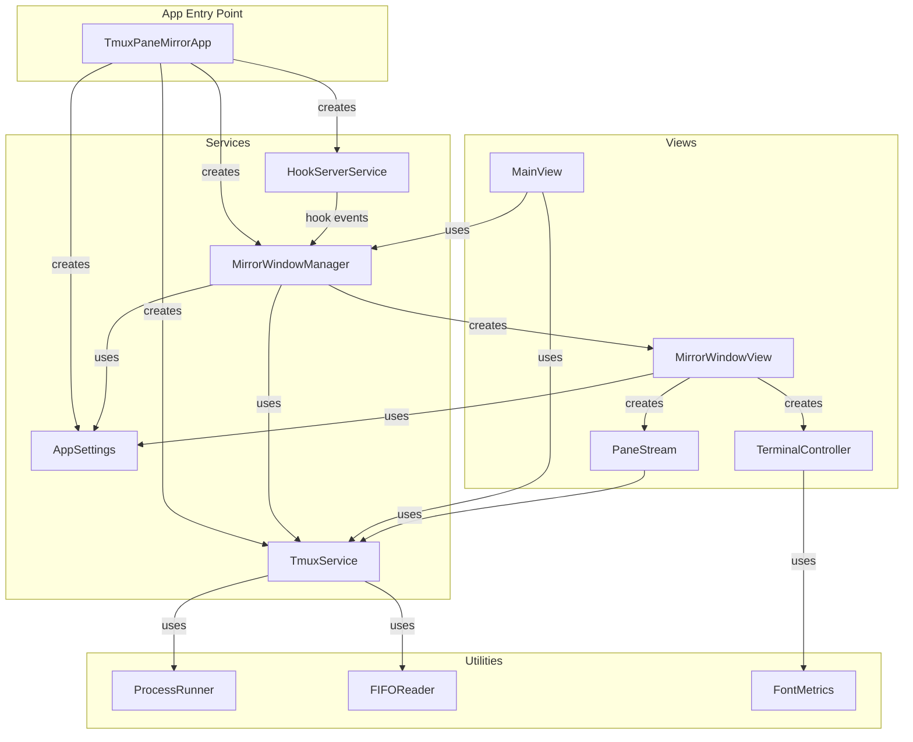
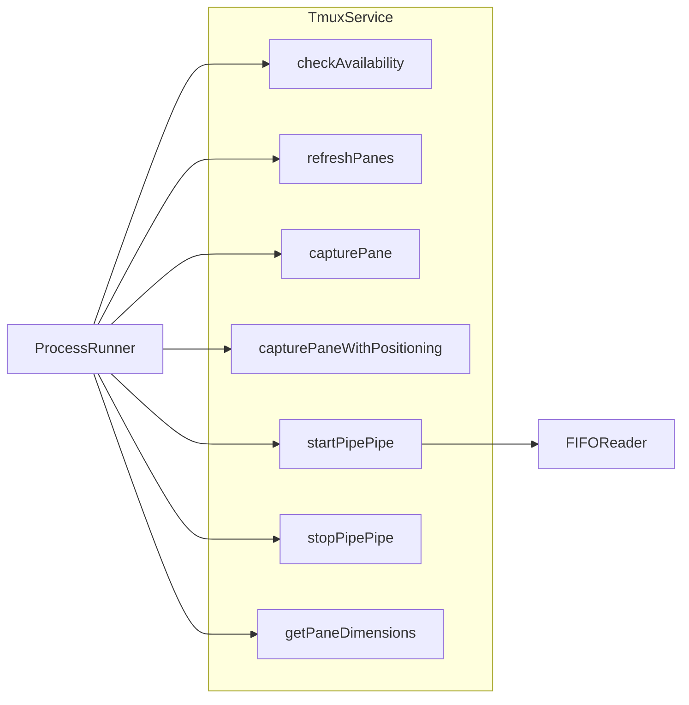
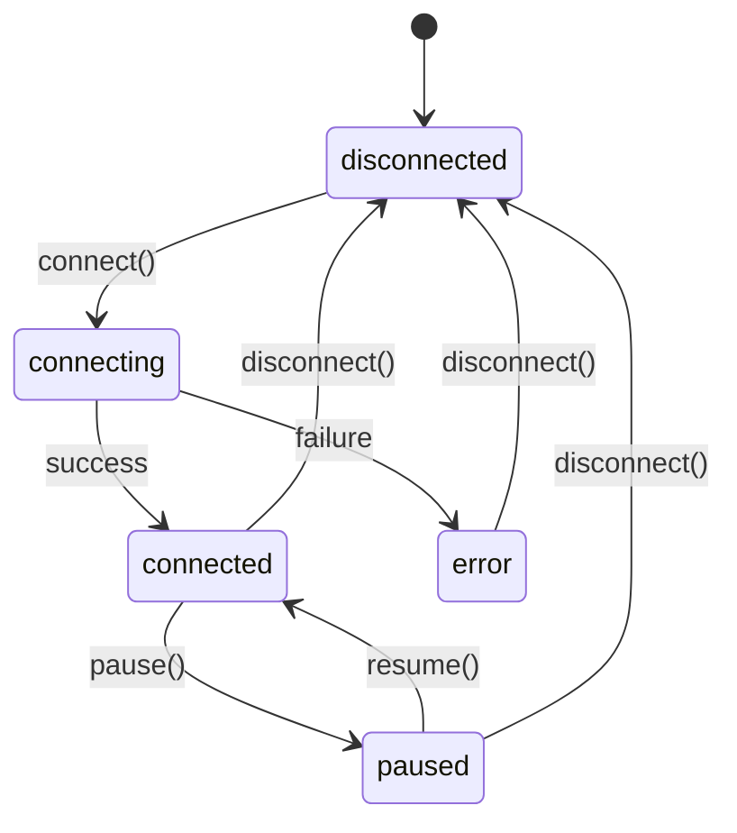
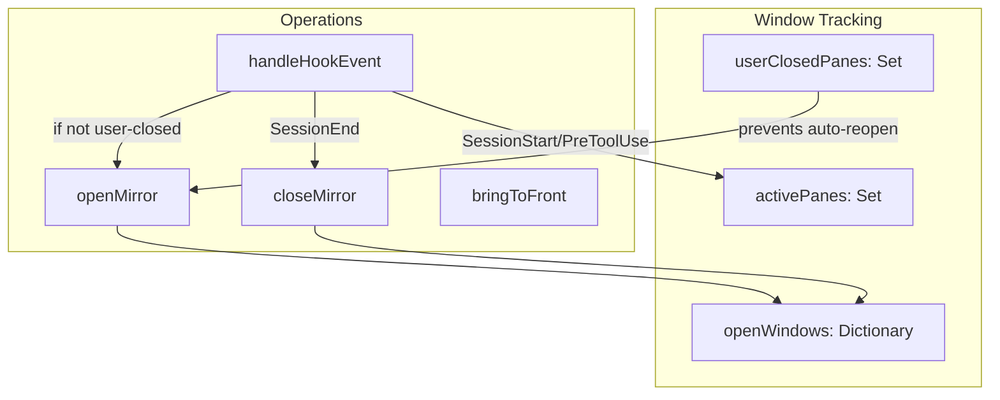
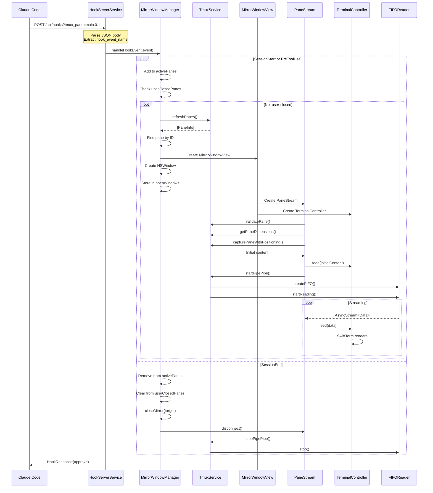
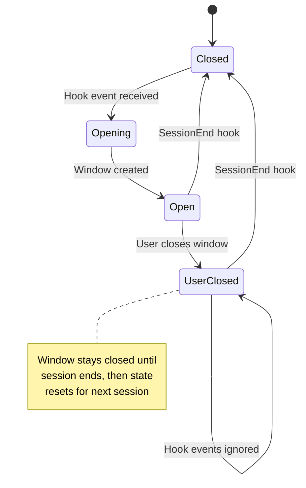
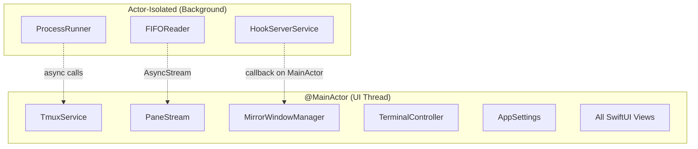

# ClaudeSpy Architecture

ClaudeSpy is a native macOS application that displays real-time mirrors of tmux panes in dedicated windows. It integrates with Claude Code via HTTP hooks to automatically open and close mirror windows when Claude Code sessions start and end.

## Component Overview

### Core Services

| Component | Type | Responsibility |
|-----------|------|----------------|
| **TmuxService** | `@Observable @MainActor` | Abstracts all tmux CLI interactions - pane discovery, content capture, streaming setup |
| **PaneStream** | `@Observable @MainActor` | Manages streaming connection lifecycle for a single tmux pane |
| **MirrorWindowManager** | `@Observable @MainActor` | NSWindow lifecycle management and hook event routing |
| **HookServerService** | `actor` | HTTP server (port 6111) receiving Claude Code hook events |
| **TerminalController** | `@Observable @MainActor` | Bridges SwiftTerm to SwiftUI with fixed terminal dimensions |
| **AppSettings** | `@Observable @MainActor` | Persistent configuration via UserDefaults |

### Utilities

| Component | Type | Responsibility |
|-----------|------|----------------|
| **ProcessRunner** | `actor` | Executes external processes asynchronously |
| **FIFOReader** | `actor` | Manages named pipes for streaming tmux output |
| **FontMetrics** | `enum` | Calculates terminal font metrics matching SwiftTerm |

## Component Relationships



## Service Details

### TmuxService

Central abstraction for all tmux CLI interactions.



**Key Operations:**
- **Pane Discovery:** `list-panes -a` to enumerate all panes
- **Content Capture:** `capture-pane -p -e` for ANSI-preserved content
- **Streaming:** `pipe-pane` to FIFO for live output

### PaneStream

Manages the streaming connection lifecycle for a single pane.



### MirrorWindowManager

Manages NSWindow instances and handles hook events.



### HookServerService

Vapor-based HTTP server receiving Claude Code events.

**Endpoints:**
- `GET /health` - Health check
- `POST /api/hooks` - Hook event receiver

**Query Parameters:**
- `project_path` - Project directory
- `tmux_pane` - Target pane (e.g., `main:0.1`)

## Hook Event Flow

This diagram shows the complete flow from a Claude Code event to a rendered mirror window.



## Data Flow: Tmux Output to Terminal Display

```mermaid
flowchart LR
    subgraph Tmux
        TP[Tmux Pane]
    end

    subgraph ClaudeSpy
        PP[pipe-pane command]
        FIFO[Named Pipe<br/>/tmp/tmux-mirror-*.fifo]
        FR[FIFOReader]
        PS[PaneStream]
        TC[TerminalController]
        ST[SwiftTerm<br/>TerminalView]
    end

    TP -->|output| PP
    PP -->|cat >| FIFO
    FIFO -->|FileHandle| FR
    FR -->|AsyncStream<Data>| PS
    PS -->|onData callback| TC
    TC -->|feed()| ST
    ST -->|renders| Display[Mirror Window]
```

## Window Lifecycle



## Concurrency Model

ClaudeSpy uses Swift 6 strict concurrency with a clear isolation strategy:



**Key Points:**
- All UI-bound services are `@MainActor` isolated
- Background I/O uses dedicated actors
- Hook server runs independently but dispatches to `@MainActor` for UI updates
- All cross-isolation communication uses async/await

## File Structure

```
ClaudeSpyPackage/Sources/ClaudeSpyServerFeature/
├── Hooks/
│   ├── HookModels.swift          # Event types, ToolInput enum
│   └── HookServerService.swift   # Vapor HTTP server
├── Managers/
│   └── MirrorWindowManager.swift # Window lifecycle
├── Models/
│   ├── PaneInfo.swift            # Tmux pane representation
│   └── Settings.swift            # AppSettings
├── Services/
│   ├── PaneStream.swift          # Stream management
│   └── TmuxService.swift         # Tmux abstraction
├── Utilities/
│   ├── FIFOReader.swift          # Named pipe handling
│   ├── FontMetrics.swift         # Terminal sizing
│   └── ProcessRunner.swift       # Process execution
└── Views/
    ├── ContentView.swift         # Root view
    ├── MainView.swift            # Pane list
    ├── MirrorWindowView.swift    # Mirror display
    ├── PaneListView.swift        # Pane list items
    ├── SettingsView.swift        # Settings UI
    └── TerminalContainerView.swift # SwiftTerm bridge
```
