# Terminal Streaming Architecture

This document describes how terminal data flows from a tmux session on the Mac to both the local Mac mirror view and remote iOS devices. The architecture achieves low-latency mirroring with proper UTF-8 handling, data batching, and end-to-end encryption.

## High-Level Overview

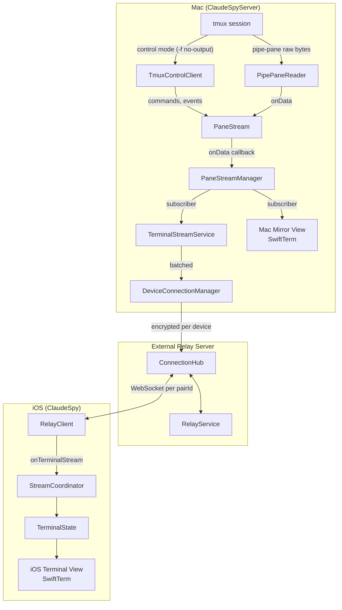

## Component Details

### 1. Tmux Data Capture (Mac)

The Mac app uses a **hybrid approach**: tmux control mode for commands and event notifications, and `pipe-pane` for raw PTY byte delivery.

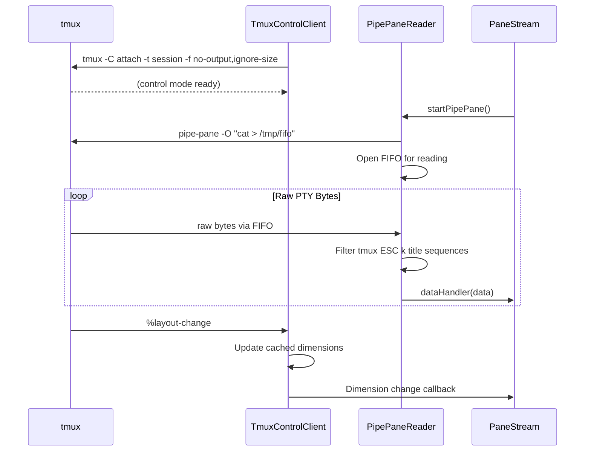

**Key Files:**
- `ClaudeSpyServerFeature/Services/PipePaneReader.swift`
- `ClaudeSpyServerFeature/Services/TmuxControlClient.swift`
- `ClaudeSpyServerFeature/Services/TmuxService.swift`

**PipePaneReader** is an actor that:
- Manages a per-pane FIFO (`/tmp/claudespy-pipe-<id>.fifo`) for raw byte delivery
- Reads raw PTY bytes via `pipe-pane -O` piped through the FIFO
- Filters only tmux's `ESC k ... ESC \` title sequences
- Uses AsyncStream + single consumer task for strict FIFO ordering of data chunks
- Supports buffering during initial capture (collects data without delivering, then flushes)

**TmuxControlClient** is an actor that:
- Maintains a long-lived `tmux -C attach -f no-output,ignore-size` process
- Handles commands via `sendCommand()` (capture-pane, list-panes, pipe-pane, etc.)
- Parses event notifications (`%layout-change`, `%session-changed`, `%exit`)
- Does **not** handle `%output` events (suppressed by `-f no-output`)

### 2. Local Stream Management (Mac)

**PaneStream** manages a single pane's connection lifecycle:

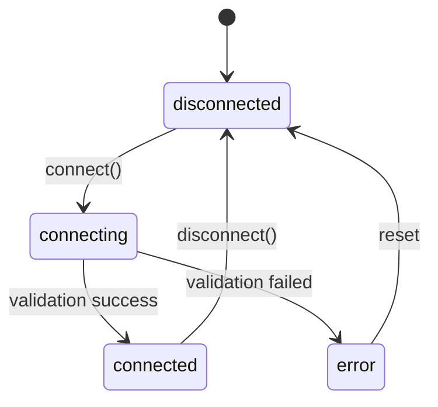

**PaneStreamManager** multiplexes streams to multiple subscribers:

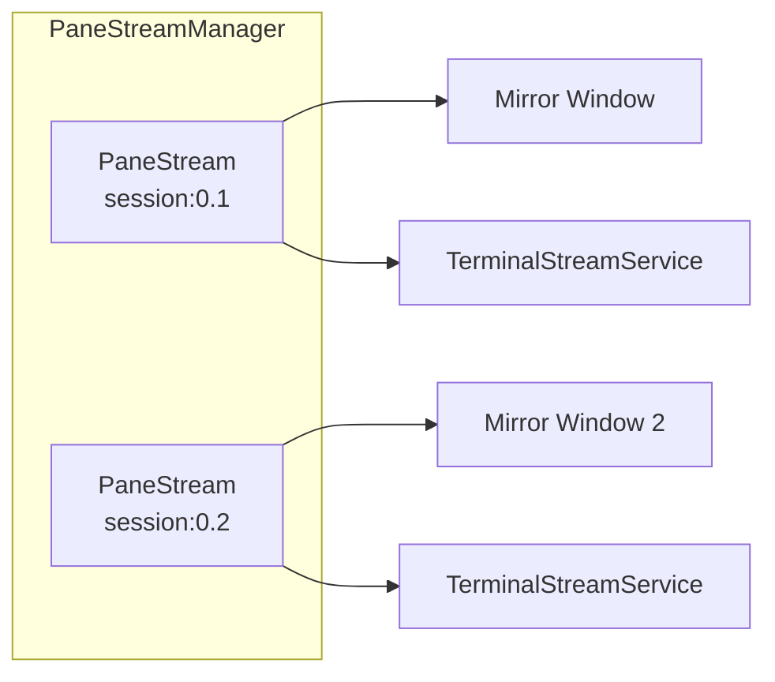

**Key Files:**
- `ClaudeSpyServerFeature/Services/PaneStream.swift`
- `ClaudeSpyServerFeature/Services/PaneStreamManager.swift`
- `ClaudeSpyServerFeature/Services/PipePaneReader.swift`

Subscribers share a single stream—when the last subscriber unsubscribes, the stream disconnects. PaneStream owns a `PipePaneReader` for live data and uses `TmuxControlClientManager` for commands and dimension tracking.

### 3. Mac Mirror View

The local Mac mirror receives data through a PaneStreamManager subscription:

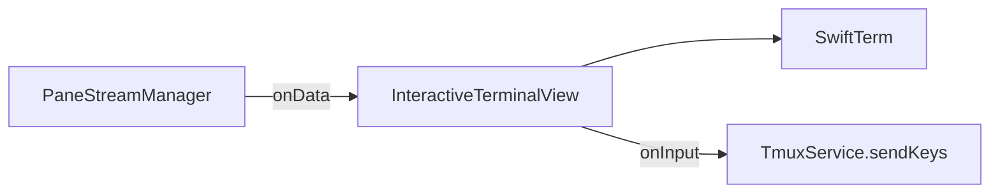

**Key File:** `ClaudeSpyServerFeature/Views/InteractiveTerminalView.swift`

### 4. Remote Streaming (Mac → Server)

**TerminalStreamService** bridges local streams to all connected iOS devices via **DeviceConnectionManager**:

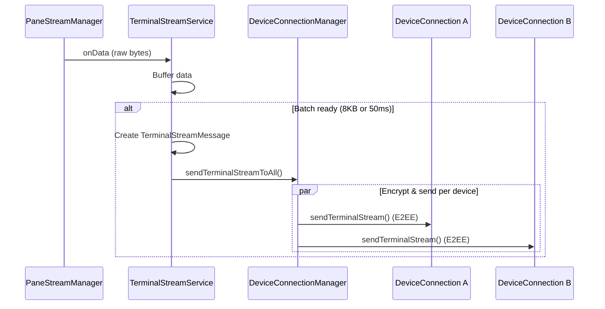

**Batching Strategy:**
- Minimum interval: 50ms (max 20 updates/sec)
- Maximum batch size: 8KB
- Prevents network saturation from high-frequency terminal updates

**Multi-Device Reference Counting:**
- `TerminalStreamService` tracks `deviceSubscriberCount` per pane
- First iOS device subscribing creates the PaneStreamManager subscription
- Additional devices reuse the existing stream (count incremented, current content sent)
- `stopStreaming()` decrements count; stream only fully stops when count reaches 0
- System-level cleanups (`stopAllStreams`, `stopStreamsForClosedPanes`) use `force: true`

**Message Types:**
```swift
enum StreamUpdateType {
    case initialState(InitialState)     // Full buffer on stream start
    case dataChunk(DataChunk)           // Incremental updates
    case dimensionChange(DimensionChange) // Terminal resized
    case streamEnd                       // Stream closed
}
```

**Key Files:**
- `ClaudeSpyServerFeature/Services/TerminalStreamService.swift`
- `ClaudeSpyServerFeature/Services/DeviceConnectionManager.swift`
- `ClaudeSpyServerFeature/Services/DeviceConnection.swift`

### 5. External Relay Server

The Vapor server routes messages between paired Mac and iOS devices. Each pairing (pairId) represents one Mac-iOS device pair. A Mac can have multiple pairings (one per iOS device), and each pairing has its own WebSocket connection.

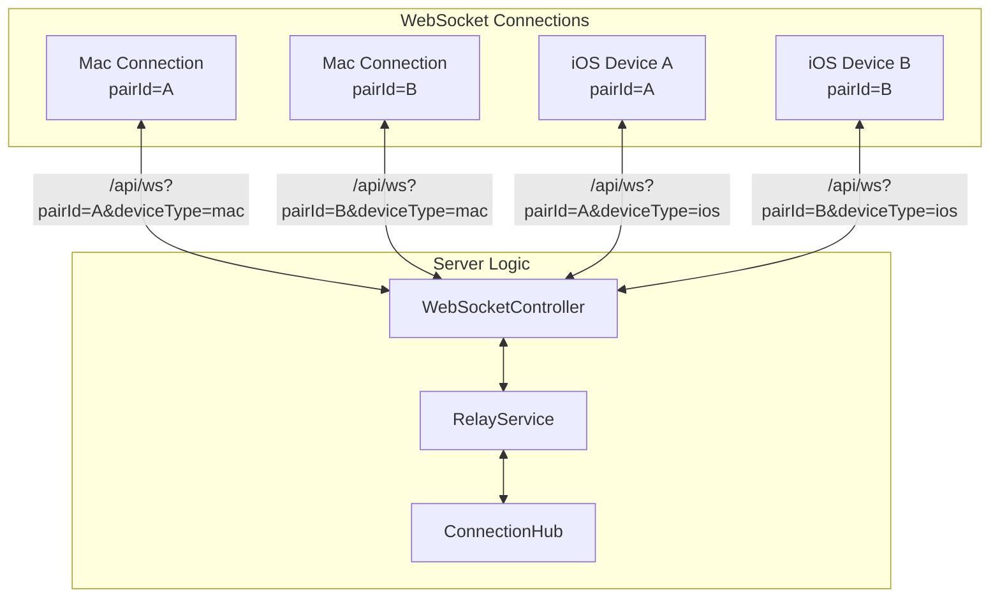

**ConnectionHub** maintains the connection registry:

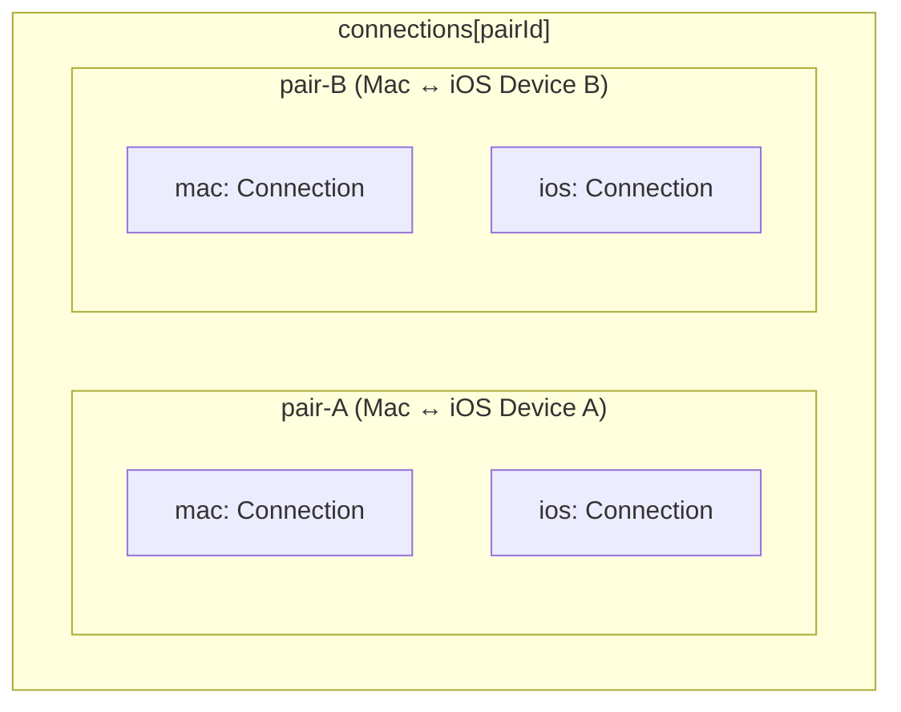

**Message Routing:**
1. Mac's `DeviceConnectionManager` sends encrypted terminal data per device
2. Each `DeviceConnection` sends via its own WebSocket (unique pairId)
3. RelayService receives message, looks up iOS connection by pairId
4. ConnectionHub forwards to iOS (encrypted payload is pass-through)
5. Server cannot decrypt—true end-to-end encryption

**Key Files:**
- `ClaudeSpyExternalServer/Routes/WebSocketController.swift`
- `ClaudeSpyExternalServer/Services/RelayService.swift`
- `ClaudeSpyExternalServer/Services/ConnectionHub.swift`

### 6. iOS Reception

**RelayClient** receives WebSocket messages and decrypts them:

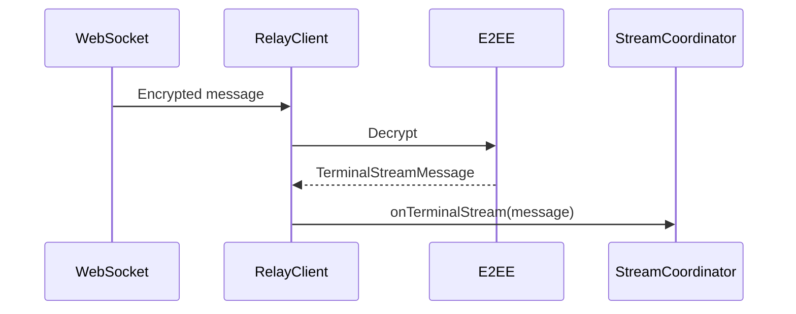

**Key File:** `ClaudeSpyFeature/Services/RelayClient.swift`

### 7. iOS Display

**StreamCoordinator** manages the streaming session state:

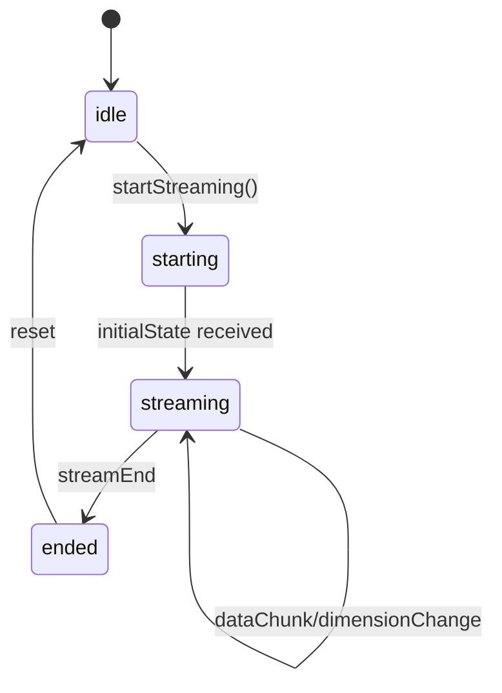

**Data flow to terminal:**

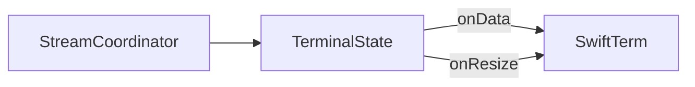

**Key Files:**
- `ClaudeSpyFeature/Views/LiveTerminalView.swift`
- `ClaudeSpyFeature/Views/TerminalStreamContainerView.swift`

## Complete Data Flow

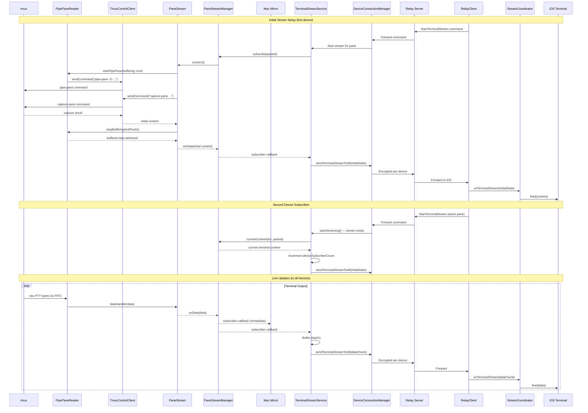

## Key Architectural Decisions

| Decision | Rationale |
|----------|-----------|
| **Hybrid: control mode + pipe-pane** | Control mode for commands/events, pipe-pane for raw PTY bytes. Eliminates octal unescaping, UTF-8 reconstruction, and line-boundary splitting that caused rendering artifacts |
| **FIFO-based pipe-pane delivery** | Per-pane FIFO (`/tmp/claudespy-pipe-<id>.fifo`) avoids spawning a persistent subprocess; tmux's `cat > fifo` blocks until reader connects |
| **AsyncStream ordering** | Single consumer task per data source (PipePaneReader, TmuxControlClient, TerminalStreamService) prevents reordering that occurs with unstructured `Task {}` per callback |
| **Buffering during initial capture** | PipePaneReader collects raw bytes without delivering while capture-pane runs, then flushes — eliminates gap between capture and live stream |
| **Stream manager decoupling** | Streaming works without mirror window open, only needs iOS connection |
| **Data batching (8KB/50ms)** | Prevents network saturation from high-frequency output |
| **Subscription model** | Multiple consumers (UI + remote) share one stream efficiently |
| **Multi-device ref counting** | Multiple iOS devices watch the same pane without interfering; iOS ignores duplicate `initialState` when already streaming |
| **Per-device E2EE** | Each DeviceConnection has its own E2EE session; server cannot decrypt |
| **Session ID validation** | Prevents stale callbacks from old sessions affecting new ones |
| **Fail-closed E2EE** | Refuses to send sensitive data if encryption session not established |

## Key Types Reference

| Type | Location | Purpose |
|------|----------|---------|
| `PipePaneReader` | ServerFeature | Per-pane FIFO reader for raw PTY bytes via pipe-pane |
| `TmuxControlClient` | ServerFeature | Control mode connection for commands and event notifications |
| `PaneStream` | ServerFeature | Single pane stream lifecycle (owns PipePaneReader + control client registration) |
| `PaneStreamManager` | ServerFeature | Multiplexes streams to subscribers |
| `TerminalStreamService` | ServerFeature | Batches and sends to remote, ref-counted per device |
| `DeviceConnectionManager` | ServerFeature | Multi-device WebSocket coordinator |
| `DeviceConnection` | ServerFeature | Single iOS device WebSocket + E2EE |
| `ConnectionHub` | ExternalServer | Server-side routing |
| `RelayService` | ExternalServer | Message handling |
| `RelayClient` | Feature (iOS) | iOS WebSocket client |
| `StreamCoordinator` | Feature (iOS) | iOS streaming state |
| `TerminalState` | Feature (iOS) | Bridge to SwiftTerm |
| `TerminalStreamMessage` | Networking | Shared message model |
