# Terminal Streaming Architecture

This document describes how terminal data flows from a tmux session on the Mac to both the local Mac mirror view and remote iOS devices. The architecture achieves low-latency mirroring with proper UTF-8 handling, data batching, and end-to-end encryption.

## High-Level Overview

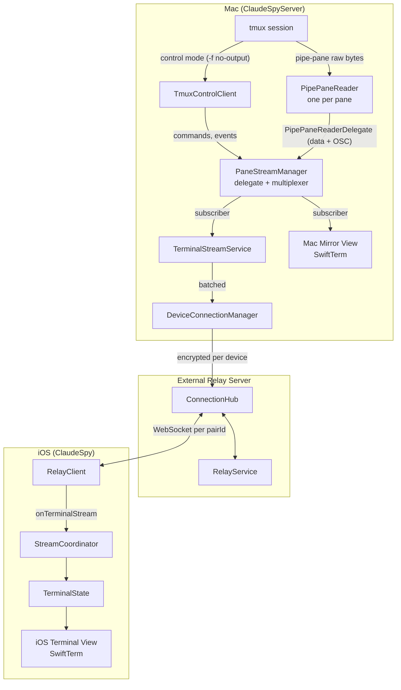

## Component Details

### 1. Tmux Data Capture (Mac)

The Mac app uses a **hybrid approach**: tmux control mode for commands and event notifications, and `pipe-pane` for raw PTY byte delivery.

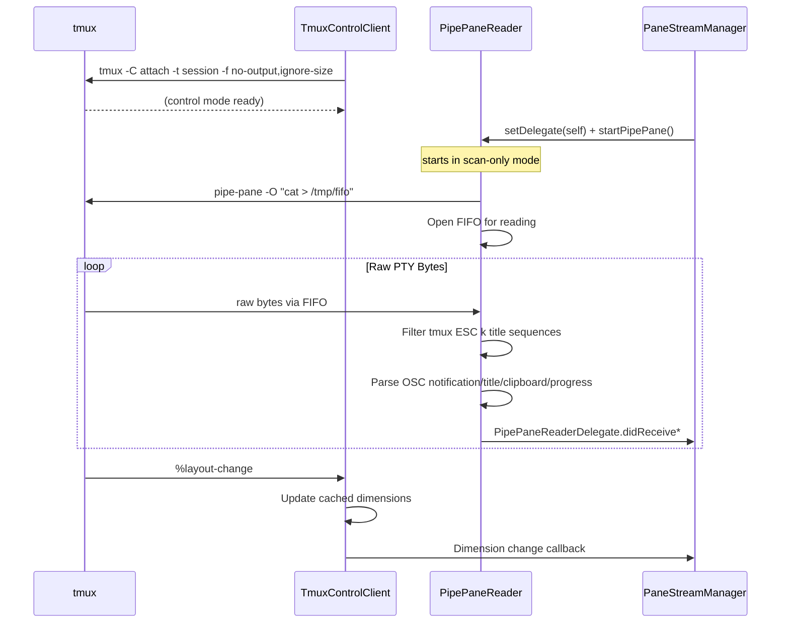

**Key Files:**
- `ClaudeSpyServerFeature/Services/PipePaneReader.swift`
- `ClaudeSpyServerFeature/Services/TmuxControlClient.swift`
- `ClaudeSpyServerFeature/Services/TmuxService.swift`

**PipePaneReader** is an actor that:
- Manages a per-pane FIFO (`/tmp/claudespy-pipe-<id>.fifo`) for raw byte delivery. One reader instance per tmux pane lives for the pane's full lifetime — mirror toggling never restarts it
- Reads raw PTY bytes via `pipe-pane -O` piped through the FIFO
- Filters only tmux's `ESC k ... ESC \` title sequences and parses OSC 9/777/9;4/0/2/52 notification, title, clipboard, and progress events
- Uses AsyncStream + single consumer task for strict FIFO ordering of data chunks
- Forwards events through a single `PipePaneReaderDelegate` (`@MainActor`) — one method per event type so missing a wiring becomes a compile error
- Has three data-delivery modes:
  - **`scanOnly`** (default after `startPipePane`): parser doesn't build `filteredData`, data bytes are discarded. OSC events still flow.
  - **`buffering`** (`setBuffering(true)`): bytes queued instead of forwarded; used while a `capture-pane` snapshot is being taken so live bytes that arrive during the snapshot aren't dropped.
  - **`live`** (`flushBuffer`): drains the queue to the delegate in order, then forwards subsequent bytes directly.

**TmuxControlClient** is an actor that:
- Maintains a long-lived `tmux -C attach -f no-output,ignore-size` process
- Handles commands via `sendCommand()` (capture-pane, list-panes, pipe-pane, etc.)
- Parses event notifications (`%layout-change`, `%session-changed`, `%exit`)
- Does **not** handle `%output` events (suppressed by `-f no-output`)

### 2. Local Stream Management (Mac)

**PaneStreamManager** owns one `PipePaneReader` per known pane and multiplexes its events to subscribers. It conforms to `PipePaneReaderDelegate` so all event wiring lives in exactly one place.

The reader's data-delivery mode is the state machine that used to belong to a separate `PaneStream`:

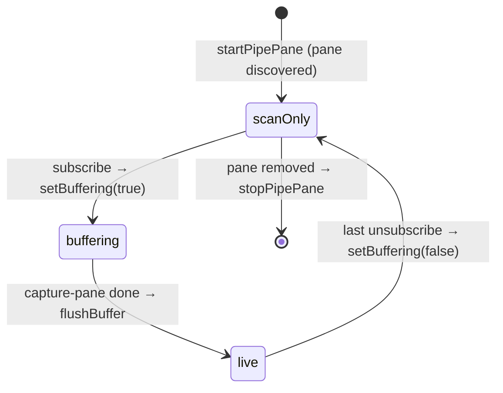

`subscribe(paneId:target:...)` follows the canonical sequence:

1. `setBuffering(true)` — start retaining live bytes.
2. `capture-pane` snapshot via control mode.
3. Add subscriber.
4. `flushBuffer()` — drain the queue through the delegate (this manager) → `forwardData` → subscriber's `onData`. Subsequent bytes flow live.

When the last subscriber leaves, the manager only calls `setBuffering(false)`. The reader stays attached to the FIFO, so OSC events (notifications, titles, progress, clipboard) keep flowing for desktop notifications and sidebar UI.

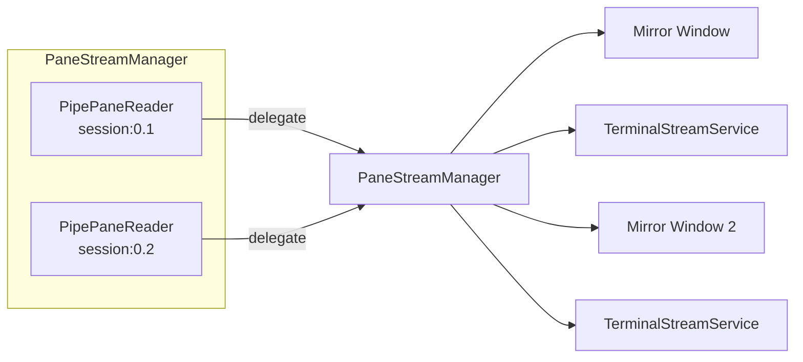

**Key Files:**
- `ClaudeSpyServerFeature/Services/PaneStreamManager.swift`
- `ClaudeSpyServerFeature/Services/PipePaneReader.swift`

Subscribers share a single reader. PaneStreamManager uses `TmuxControlClientManager` for commands (capture-pane, pipe-pane attach) and dimension tracking; per-pane state lives in a single `readers: [String: ReaderContext]` dictionary that records the reader, target, dimensions, subscriber set, and latest title.

### 3. Mac Mirror View

The local Mac mirror receives data through a PaneStreamManager subscription:

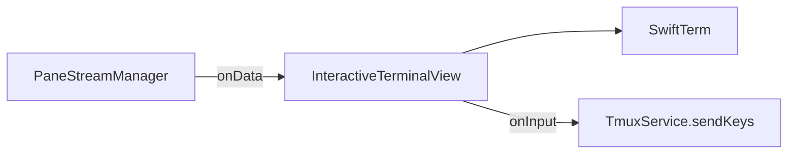

**Key File:** `ClaudeSpyServerFeature/Views/InteractiveTerminalView.swift`

### 4. Remote Streaming (Mac → Server)

**TerminalStreamService** bridges local streams to all connected iOS devices via **DeviceConnectionManager**:

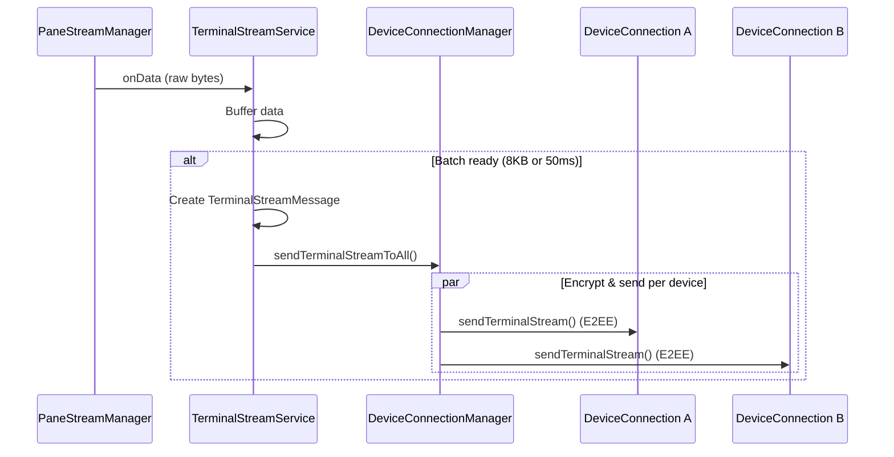

**Batching Strategy:**
- Minimum interval: 50ms (max 20 updates/sec)
- Maximum batch size: 8KB
- Prevents network saturation from high-frequency terminal updates

**Multi-Device Reference Counting:**
- `TerminalStreamService` tracks `deviceSubscriberCount` per pane
- First iOS device subscribing creates the PaneStreamManager subscription
- Additional devices reuse the existing stream (count incremented, current content sent)
- `stopStreaming()` decrements count; stream only fully stops when count reaches 0
- System-level cleanups (`stopAllStreams`, `stopStreamsForClosedPanes`) use `force: true`

**Message Types:**
```swift
enum StreamUpdateType {
    case initialState(InitialState)     // Full buffer on stream start
    case dataChunk(DataChunk)           // Incremental updates
    case dimensionChange(DimensionChange) // Terminal resized
    case streamEnd                       // Stream closed
}
```

**Key Files:**
- `ClaudeSpyServerFeature/Services/TerminalStreamService.swift`
- `ClaudeSpyServerFeature/Services/DeviceConnectionManager.swift`
- `ClaudeSpyServerFeature/Services/DeviceConnection.swift`

### 5. External Relay Server

The Vapor server routes messages between paired Mac and iOS devices. Each pairing (pairId) represents one Mac-iOS device pair. A Mac can have multiple pairings (one per iOS device), and each pairing has its own WebSocket connection.

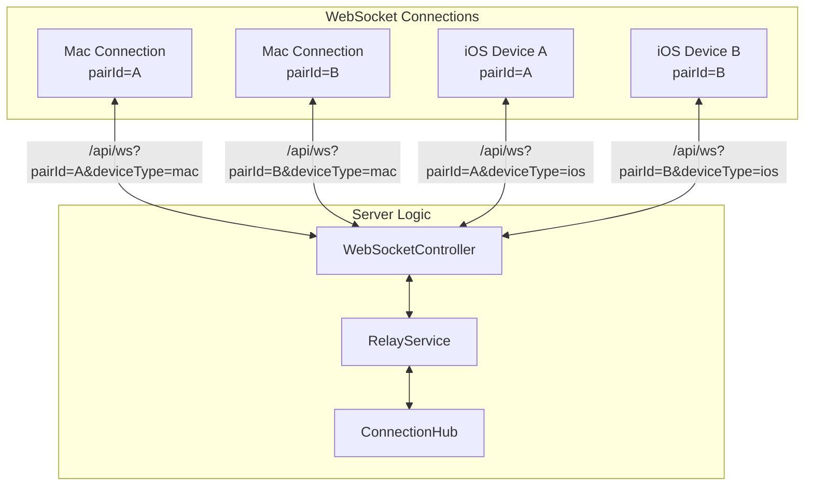

**ConnectionHub** maintains the connection registry:

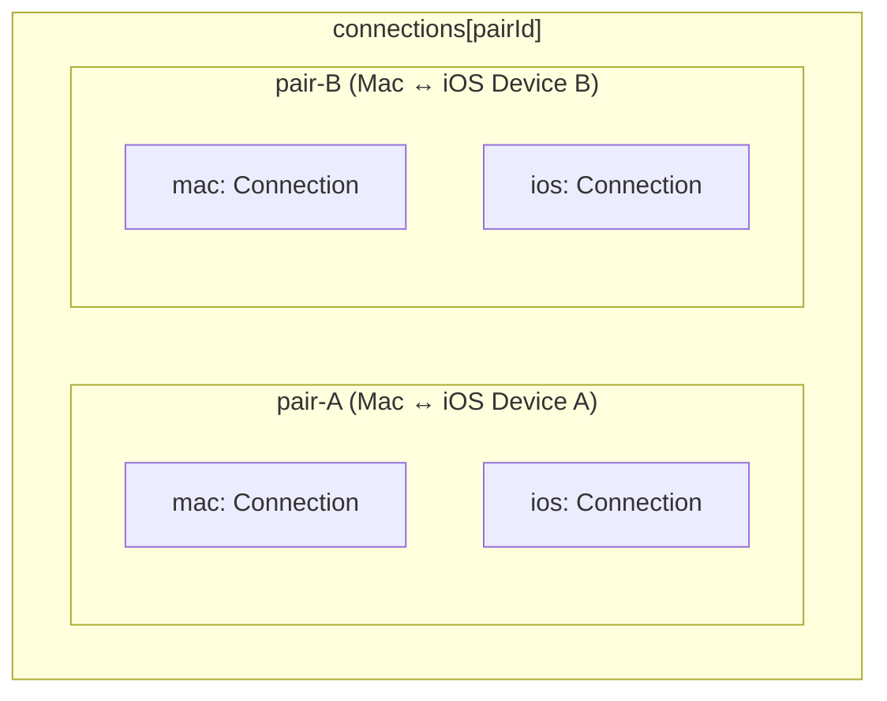

**Message Routing:**
1. Mac's `DeviceConnectionManager` sends encrypted terminal data per device
2. Each `DeviceConnection` sends via its own WebSocket (unique pairId)
3. RelayService receives message, looks up iOS connection by pairId
4. ConnectionHub forwards to iOS (encrypted payload is pass-through)
5. Server cannot decrypt—true end-to-end encryption

**Key Files:**
- `ClaudeSpyExternalServer/Routes/WebSocketController.swift`
- `ClaudeSpyExternalServer/Services/RelayService.swift`
- `ClaudeSpyExternalServer/Services/ConnectionHub.swift`

### 6. iOS Reception

**RelayClient** receives WebSocket messages and decrypts them:

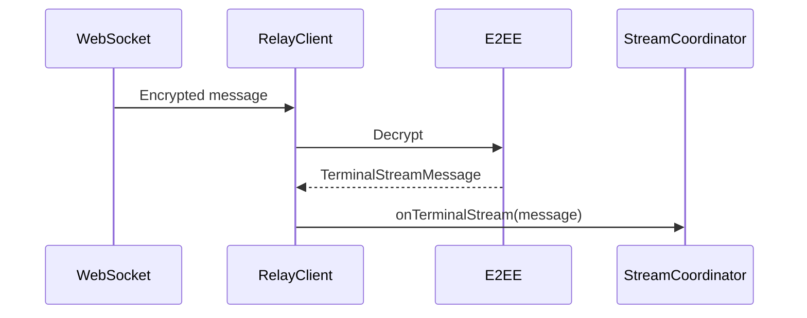

**Key File:** `ClaudeSpyFeature/Services/RelayClient.swift`

### 7. iOS Display

**StreamCoordinator** manages the streaming session state:

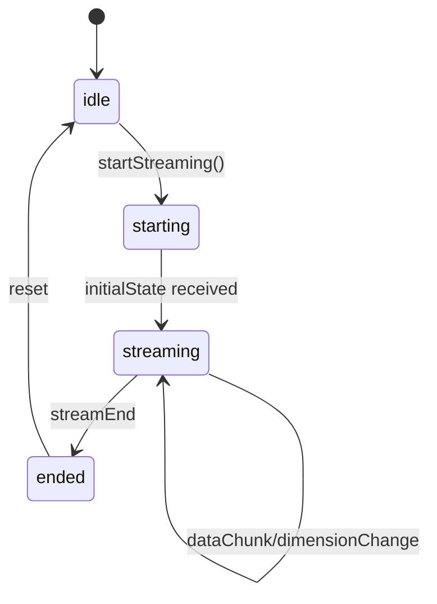

**Data flow to terminal:**

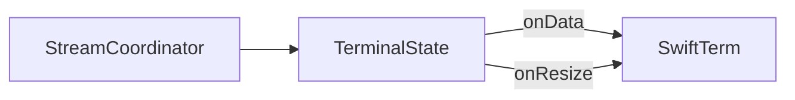

**Key Files:**
- `ClaudeSpyFeature/Views/LiveTerminalView.swift`
- `ClaudeSpyFeature/Views/TerminalStreamContainerView.swift`

### 8. Connection Liveness & Reconnection

A network switch (Wi-Fi↔Wi-Fi, Wi-Fi↔cellular, VPN toggle) leaves a
`URLSessionWebSocketTask` **half-open**: the old TCP connection is dead but
neither `send()` nor a blocked `receive()` errors promptly. Two mechanisms keep
this from turning into a stuck "green dot but nothing flows" state (issue #642):

**Client-side liveness watchdog** — `ViewerRelayClient` (viewer) and
`ConnectedViewer` (host) run a keep-alive ping loop that now *verifies* a reply.
Each cycle sets an `awaitingPong` flag before sending `.ping`; **any** inbound
frame (the `.pong`, terminal data, session state…) clears it. If the flag is
still set after the pong timeout, the socket is treated as half-open and
`cancel()`led, which makes `receiveMessages()` observe the failure and run the
normal disconnection → exponential-backoff reconnection path exactly once.
Without this, a half-open socket stays `.connected` indefinitely and only
`receive()` erroring (which a network switch does not reliably cause) or an app
restart would recover it.

**Server-side identity-aware unregister** — when a device reconnects it opens a
*new* socket that replaces the old entry in `ConnectionHub` (keyed by
`(pairId, deviceType)`). The old half-open socket's `onClose` can fire
seconds-to-minutes later. `ConnectionHub.unregisterIfCurrent(...)` only removes
the entry (and only then notifies the peer of a disconnect) when the closing
socket is *still the registered one*, so a stale close — or a `send` that fails
on a socket that was concurrently replaced — is a no-op. This prevents a late
close from evicting the live replacement and falsely flipping the peer's
`isViewerConnected`/`isHostConnected` to false. That flag gates
`pushSessionState()` (but not `sendTerminalStream()`), so the bug it caused was
specifically "live terminal keeps streaming, but new-session/new-tab/switch-window
updates never reach the viewer."

> **Server-initiated teardown must notify the peer itself.** `notifyConnection`
> for a disconnect only fires from `WebSocketController`'s `onClose` (which owns
> `RelayService`). A server-initiated teardown — the E2E `blockDevice` /
> `disconnectDevice` helpers, which close the socket *and* remove the
> `ConnectionHub` entry directly (so `isViewerConnected` / `isHostConnected` flip
> to false immediately) — makes that later `onClose` a deliberate no-op under
> `unregisterIfCurrent`, since the entry is already gone. So those helpers take
> the pair IDs returned by `disconnectAll(deviceType:)` and drive
> `notifyConnection(..., connected: false)` themselves; otherwise a viewer whose
> host was disconnected would never learn to clear its sessions (regression that
> surfaced in the *Host Disconnect Clears Sessions* E2E scenario).

## Complete Data Flow

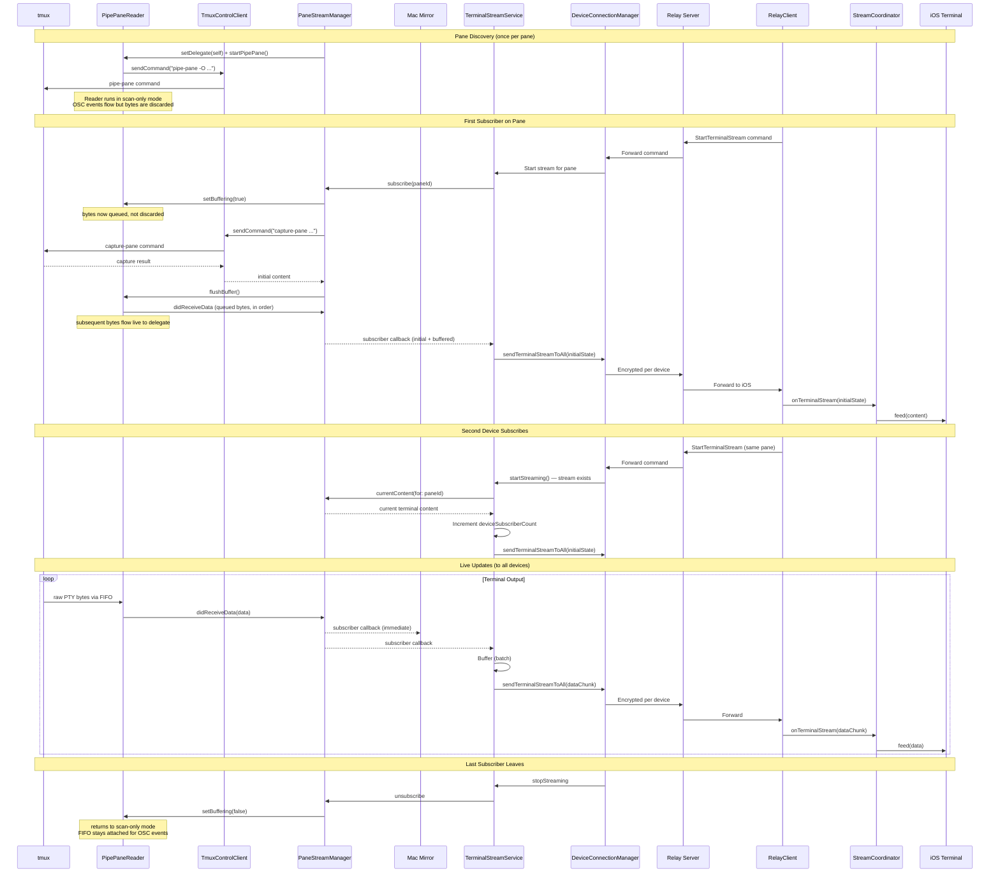

## Key Architectural Decisions

| Decision | Rationale |
|----------|-----------|
| **Hybrid: control mode + pipe-pane** | Control mode for commands/events, pipe-pane for raw PTY bytes. Eliminates octal unescaping, UTF-8 reconstruction, and line-boundary splitting that caused rendering artifacts |
| **FIFO-based pipe-pane delivery** | Per-pane FIFO (`/tmp/claudespy-pipe-<id>.fifo`) avoids spawning a persistent subprocess; tmux's `cat > fifo` blocks until reader connects |
| **AsyncStream ordering** | Single consumer task per data source (PipePaneReader, TmuxControlClient, TerminalStreamService) prevents reordering that occurs with unstructured `Task {}` per callback |
| **One persistent reader per pane** | PipePaneReader is created at pane discovery and lives until the pane is removed. Mirror toggling switches its delivery mode (`scanOnly`/`buffering`/`live`) instead of detaching/reattaching `pipe-pane`, eliminating the FIFO swap window where bytes could be lost. All event wiring lives on a single `PipePaneReaderDelegate` so missing a handler is a compile error |
| **Buffering during initial capture** | PipePaneReader queues raw bytes during the `capture-pane` snapshot, then `flushBuffer()` drains the queue to the delegate in order before switching to live mode — eliminates the gap between capture and live stream |
| **Stream manager decoupling** | Streaming works without mirror window open, only needs iOS connection |
| **Data batching (8KB/50ms)** | Prevents network saturation from high-frequency output |
| **Subscription model** | Multiple consumers (UI + remote) share one stream efficiently |
| **Multi-device ref counting** | Multiple iOS devices watch the same pane without interfering; iOS ignores duplicate `initialState` when already streaming |
| **Per-device E2EE** | Each DeviceConnection has its own E2EE session; server cannot decrypt |
| **Session ID validation** | Prevents stale callbacks from old sessions affecting new ones |
| **Fail-closed E2EE** | Refuses to send sensitive data if encryption session not established |
| **Ping/pong liveness watchdog** | Verifies keep-alive pongs so a half-open socket after a network switch is detected and reconnected within one ping cycle instead of staying `.connected` forever (§8) |
| **Identity-aware unregister** | The relay only unregisters a connection when the closing socket is still the registered one, so a stale socket's late close can't evict the reconnected replacement (§8) |

## Key Types Reference

| Type | Location | Purpose |
|------|----------|---------|
| `PipePaneReader` | ServerFeature | Per-pane FIFO reader for raw PTY bytes via pipe-pane. Three delivery modes (scanOnly/buffering/live), one per pane lifetime |
| `PipePaneReaderDelegate` | ServerFeature | `@MainActor` protocol for receiving data + OSC events from a reader |
| `TmuxControlClient` | ServerFeature | Control mode connection for commands and event notifications |
| `PaneStreamManager` | ServerFeature | Owns one reader per pane, conforms to `PipePaneReaderDelegate`, multiplexes events to subscribers |
| `TerminalStreamService` | ServerFeature | Batches and sends to remote, ref-counted per device |
| `DeviceConnectionManager` | ServerFeature | Multi-device WebSocket coordinator |
| `DeviceConnection` | ServerFeature | Single iOS device WebSocket + E2EE |
| `ConnectionHub` | ExternalServer | Server-side routing |
| `RelayService` | ExternalServer | Message handling |
| `RelayClient` | Feature (iOS) | iOS WebSocket client |
| `StreamCoordinator` | Feature (iOS) | iOS streaming state |
| `TerminalState` | Feature (iOS) | Bridge to SwiftTerm |
| `TerminalStreamMessage` | Networking | Shared message model |
